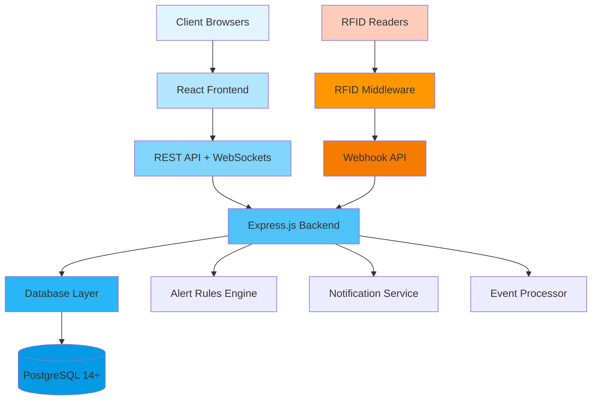

# AssetTrackPro - System Architecture
## RFID-Based Real-Time Asset Tracking Platform

**Last Updated:** February 13, 2026  
**Version:** 2.0.0 (RFID Production-Ready)  
**Schema Revision:** 2.0 (Lecturer Approved ✅)

---

## Overview Architecture



## Multi-Layer System Architecture (RFID-Enhanced)

```
┌─────────────────────────────────────────────────────────────┐
│                   CLIENT LAYER                              │
│  ┌───────────────────────────────────────────────────────┐ │
│  │    Web Browser  │  Mobile App  │  Tablet              │ │
│  │    (React App)                                         │ │
│  └───────────────────────────────────────────────────────┘ │
└─────────────────────────────┬───────────────────────────────┘
                              │ HTTPS/WSS
                              ▼
┌─────────────────────────────────────────────────────────────┐
│                PRESENTATION LAYER                           │
│  ┌───────────────────────────────────────────────────────┐ │
│  │          React Frontend (Vite + React 19.2)           │ │
│  │                                                        │ │
│  │  Components/                                          │ │
│  │    ├── AssetList, AssetDetails, ZoneViewer           │ │
│  │    ├── RealtimeDashboard, AlertPanel 🔔              │ │
│  │    ├── MovementHistory, AnalyticsCharts               │ │
│  │    └── Header, Footer, Navigation                     │ │
│  │                                                        │ │
│  │  Pages/                                               │ │
│  │    ├── Home, Dashboard, Assets, Zones                 │ │
│  │    ├── Alerts, Reports, Analytics, Settings           │ │
│  │    └── Employees, Assignments, Buildings              │ │
│  │                                                        │ │
│  │  Services/                                            │ │
│  │    ├── api.js (Axios + JWT interceptors)             │ │
│  │    ├── assetService, movementService                  │ │
│  │    ├── alertService, zoneService                      │ │
│  │    └── realtimeService (WebSocket client - Phase 2)  │ │
│  └───────────────────────────────────────────────────────┘ │
└─────────────────────────────┬───────────────────────────────┘
                              │ REST API + WebSocket
                              ▼
┌─────────────────────────────────────────────────────────────┐
│                     API GATEWAY LAYER                       │
│  ┌───────────────────────────────────────────────────────┐ │
│  │            Express.js Middleware Stack                │ │
│  │                                                        │ │
│  │  • CORS Handler (security)                            │ │
│  │  • Body Parser (JSON)                                 │ │
│  │  • JWT Auth Middleware (verify token)                │ │
│  │  • Tenant Scope Middleware (organization_id filter)   │ │
│  │  • Rate Limiter (DDoS protection)                     │ │
│  │  • Error Handler (global exception catching)          │ │
│  │  • Request Logger (audit trail)                       │ │
│  └───────────────────────────────────────────────────────┘ │
└─────────────────────────────┬───────────────────────────────┘
                              │
                              ▼
┌─────────────────────────────────────────────────────────────┐
│                  APPLICATION LAYER                          │
│  ┌───────────────────────────────────────────────────────┐ │
│  │          Express.js Backend (Port 5000)               │ │
│  │                                                        │ │
│  │  Routes/ (API Endpoints)                              │ │
│  │    ├── /assets            → assetRoutes               │ │
│  │    ├── /movement-events   → movementEventRoutes       │ │
│  │    ├── /zones             → zoneRoutes                │ │
│  │    ├── /gates             → gateRoutes                │ │
│  │    ├── /alerts            → alertRoutes               │ │
│  │    ├── /assignments       → assignmentRoutes          │ │
│  │    ├── /rfid-webhook  ⭐  → rfidWebhookRoutes         │ │
│  │    ├── /analytics         → analyticsRoutes           │ │
│  │    ├── /employees         → employeeRoutes            │ │
│  │    └── /organizations     → organizationRoutes        │ │
│  │                                                        │ │
│  │  Controllers/ (Business Logic)                        │ │
│  │    ├── assetController.js       (CRUD assets)        │ │
│  │    ├── movementEventController.js (Event processing) │ │
│  │    ├── alertController.js       (Incident mgmt)      │ │
│  │    ├── zoneController.js        (Location mgmt)      │ │
│  │    ├── rfidWebhookController.js ⭐ (RFID events)    │ │
│  │    └── analyticsController.js   (Reporting)          │ │
│  │                                                        │ │
│  │  Services/ (Business Services)                        │ │
│  │    ├── alertRulesEngine.js  (Violation detection)    │ │
│  │    ├── rfidEventProcessor.js (Event normalization)   │ │
│  │    ├── notificationService.js (Email, SMS, push)     │ │
│  │    └── cacheService.js (Redis - optional)            │ │
│  └───────────────────────────────────────────────────────┘ │
└─────────────────────────────┬───────────────────────────────┘
                              │ SQL Queries
                              ▼
┌─────────────────────────────────────────────────────────────┐
│                      DATA ACCESS LAYER                      │
│  ┌───────────────────────────────────────────────────────┐ │
│  │           Models (Database Interaction)               │ │
│  │                                                        │ │
│  │  Hierarchical Location Models:                        │ │
│  │    ├── Organization.js (tenant root)                  │ │
│  │    ├── Branch.js (offices)                            │ │
│  │    ├── Building.js (physical structures)              │ │
│  │    ├── Zone.js (STORAGE, OFFICE, EXIT, SECURE)       │ │
│  │    └── Gate.js (RFID reader locations) 📡            │ │
│  │                                                        │ │
│  │  Core Business Models:                                │ │
│  │    ├── Employee.js (staff members)                    │ │
│  │    ├── Asset.js (RFID-tagged devices) 🏷️            │ │
│  │    ├── AssetAssignment.js (ownership tracking)        │ │
│  │    ├── MovementEvent.js ⭐ (append-only events)      │ │
│  │    └── Alert.js (security incidents) 🚨              │ │
│  └───────────────────────────────────────────────────────┘ │
└─────────────────────────────┬───────────────────────────────┘
                              │
                              ▼
┌─────────────────────────────────────────────────────────────┐
│                       DATABASE LAYER                        │
│  ┌───────────────────────────────────────────────────────┐ │
│  │          PostgreSQL 14+ (Production Database)         │ │
│  │                                                        │ │
│  │  📊 10 Core Tables:                                   │ │
│  │    ├─ organization       (multi-tenant root)          │ │
│  │    ├─ branch             (office locations)           │ │
│  │    ├─ building           (physical buildings)         │ │
│  │    ├─ zone               (logical areas)              │ │
│  │    ├─ gate               (RFID reader placements)     │ │
│  │    ├─ employee           (staff directory)            │ │
│  │    ├─ asset              (RFID-tagged items)          │ │
│  │    ├─ asset_assignment   (who has what)              │ │
│  │    ├─ movement_event ⭐  (immutable audit log)       │ │
│  │    └─ alert              (security incidents)         │ │
│  │                                                        │ │
│  │  ⚡ Performance Features:                             │ │
│  │    • 40+ strategic indexes                            │ │
│  │    • Table partitioning (movement_event by month)     │ │
│  │    • Row-level security (RLS for multi-tenancy)       │ │
│  │    • Foreign key constraints (referential integrity)  │ │
│  └───────────────────────────────────────────────────────┘ │
└─────────────────────────────┲━━━━━━━━━━━━━━━━━━━━━━━━━━━━━┘
                              ┃ TCP/HTTP (RFID events)
                              ▼
┌━━━━━━━━━━━━━━━━━━━━━━━━━━━━━━━━━━━━━━━━━━━━━━━━━━━━━━━━━━━┓
┃                   RFID HARDWARE LAYER                       ┃
┃  ┌───────────────────────────────────────────────────────┐ ┃
┃  │        RFID Middleware (Impinj ItemSense)             │ ┃
┃  │   • Event Aggregation (filter duplicate reads)        │ ┃
┃  │   • Reader Management                                 │ ┃
┃  │   • Webhook POST → Backend API                        │ ┃
┃  └─────────────┬────────────┬────────────┬───────────────┘ ┃
┃                │            │            │                  ┃
┃       ┌────────▼────┐ ┌────▼─────┐ ┌────▼─────┐           ┃
┃       │RFID Reader 1 │ │RFID Rdr 2│ │RFID Rdr 3│           ┃
┃       │(Gate A-Exit) │ │(Gate B)   │ │(Gate C)  │           ┃
┃       │Impinj R700   │ │Impinj R420│ │Zebra FX  │           ┃
┃       └──────────────┘ └───────────┘ └──────────┘           ┃
┃            📡              📡            📡                  ┃
┃         (Detects)       (Detects)    (Detects)              ┃
┃            ▲               ▲            ▲                    ┃
┃       ┌────┴───┐      ┌────┴───┐  ┌────┴───┐              ┃
┃       │ Tag 🏷️ │      │ Tag 🏷️ │  │ Tag 🏷️ │              ┃
┃       │ Laptop  │      │ Tablet │  │ Phone  │              ┃
┃       └─────────┘      └────────┘  └────────┘              ┃
┗━━━━━━━━━━━━━━━━━━━━━━━━━━━━━━━━━━━━━━━━━━━━━━━━━━━━━━━━━━━┛
```

## Request Flow Sequences

### Traditional API Request Flow

```
┌────────┐     ┌──────────┐     ┌────────────┐     ┌──────────┐     ┌──────────┐     ┌──────────┐
│ Client │     │ Frontend │     │   Routes   │     │Controller│     │  Model   │     │ Database │
└───┬────┘     └────┬─────┘     └─────┬──────┘     └────┬─────┘     └────┬─────┘     └────┬─────┘
    │               │                 │                 │               │               │
    │  GET /assets  │                 │                 │               │               │
    │──────────────>│                 │                 │               │               │
    │               │  Axios Call     │                 │               │               │
    │               │────────────────>│                 │               │               │
    │               │                 │  Route Match    │               │               │
    │               │                 │────────────────>│               │               │
    │               │                 │                 │  Extract org  │               │
    │               │                 │                 │  from JWT     │               │
    │               │                 │                 │               │               │
    │               │                 │                 │  Query DB     │               │
    │               │                 │                 │──────────────>│               │
    │               │                 │                 │               │  SELECT *     │
    │               │                 │                 │               │  WHERE org=X  │
    │               │                 │                 │               │──────────────>│
    │               │                 │                 │               │               │
    │               │                 │                 │               │  Rows         │
    │               │                 │                 │               │<──────────────│
    │               │                 │                 │  Return Data  │               │
    │               │                 │                 │<──────────────│               │
    │               │                 │  Send Response  │               │               │
    │               │                 │  {success,data} │               │               │
    │               │                 │<────────────────│               │               │
    │               │  JSON Response  │                 │               │               │
    │               │<────────────────│                 │               │               │
    │  Render UI    │                 │                 │               │               │
    │<──────────────│                 │                 │               │               │
    │               │                 │                 │               │               │
```

### RFID Event Processing Flow ⭐

```
┌──────────┐  ┌──────────┐  ┌──────────┐  ┌──────────┐  ┌──────────┐  ┌──────────┐  ┌──────────┐
│  RFID    │  │  RFID    │  │ Backend  │  │  Alert   │  │Notification│ │ Database │  │Dashboard │
│  Reader  │  │Middleware│  │ Webhook  │  │  Rules   │  │  Service   │  │          │  │ (Client) │
└─────┬────┘  └─────┬────┘  └─────┬────┘  └─────┬────┘  └─────┬──────┘  └─────┬────┘  └─────┬────┘
      │             │             │             │             │             │             │
      │ Detect Tag  │             │             │             │             │             │
      │ (15 reads   │             │             │             │             │             │
      │ over 2 sec) │             │             │             │             │             │
      │────────────>│             │             │             │             │             │
      │             │ Aggregate   │             │             │             │             │
      │             │ to logical  │             │             │             │             │
      │             │ event       │             │             │             │             │
      │             │             │             │             │             │             │
      │             │ POST webhook│             │             │             │             │
      │             │ /rfid-wbhook│             │             │             │             │
      │             │────────────>│             │             │             │             │
      │             │             │ Validate    │             │             │             │
      │             │             │ (asset &    │             │             │             │
      │             │             │  gate exist)│             │             │             │
      │             │             │             │             │             │             │
      │             │             │ INSERT INTO │             │             │             │
      │             │             │ movement_evt│             │             │             │
      │             │             │─────────────────────────────────────────>│             │
      │             │             │             │             │             │             │
      │             │             │ UPDATE asset│             │             │             │
      │             │             │ .last_seen  │             │             │             │
      │             │             │─────────────────────────────────────────>│             │
      │             │             │             │             │             │             │
      │             │             │ Check rules │             │             │             │
      │             │             │────────────>│             │             │             │
      │             │             │             │ Violation?  │             │             │
      │             │             │             │ (EXIT zone  │             │             │
      │             │             │             │  + no auth) │             │             │
      │             │             │             │             │             │             │
      │             │             │             │ INSERT alert│             │             │
      │             │             │             │─────────────────────────────────────────>│
      │             │             │             │             │             │             │
      │             │             │             │ Send notifs │             │             │
      │             │             │             │────────────>│             │             │
      │             │             │             │             │ Email 📧    │             │
      │             │             │             │             │ SMS 📱      │             │
      │             │             │             │             │ WebSocket 🔔│             │
      │             │             │             │             │─────────────────────────────>│
      │             │             │             │             │             │             │
      │             │             │ 201 Created │             │             │             │ Alert!
      │             │<────────────│             │             │             │             │ 🚨
      │             │             │             │             │             │             │
      │ ACK         │             │             │             │             │             │
      │<────────────│             │             │             │             │             │
      │             │             │             │             │             │             │

Total Latency: < 1 second (from physical detection to dashboard alert)
```

## Component Architecture (Frontend)

```
src/
│
├── components/              # Reusable UI Components
│   ├── Header/
│   │   ├── Header.jsx      ─────┐
│   │   ├── Header.css           │
│   │   └── index.js             │
│   │                             │
│   ├── Footer/                   │
│   ├── Button/                   │
│   └── ...                       │
│                                 │
├── pages/                        │ Imported by
│   ├── Home/               ◄─────┘    App.jsx
│   │   ├── Home.jsx       ─────┐
│   │   ├── Home.css            │
│   │   └── index.js            │
│   │                            │
│   ├── Assets/                  │
│   │   ├── Assets.jsx    ◄──┐  │
│   │   └── ...               │  │
│   │                         │  │
│   └── ...                   │  │
│                             │  │
├── services/                 │  │
│   ├── api.js           ─────┼──┼──► Axios Config
│   └── assetService.js  ◄────┘  │      (API Client)
│                                │
├── hooks/                       │
│   ├── useFetch.js      ◄───────┘    Custom Hooks
│   └── useForm.js                    (Reusable Logic)
│
└── utils/
    ├── helpers.js              Utility Functions
    └── constants.js            App Constants
```

## Module Architecture (Backend)

```
src/
│
├── server.js               # Entry Point
│       │
│       └──> app.js        # Express App Configuration
│               │
│               ├──> Middleware
│               │       │
│               │       ├── auth.js
│               │       └── errorHandler.js
│               │
│               └──> Routes
│                       │
│                       └── assetRoutes.js
│                               │
│                               └──> Controllers
│                                       │
│                                       └── assetController.js
│                                               │
│                                               └──> Models
│                                                       │
│                                                       └── Asset.js
│                                                               │
│                                                               └──> Database
```

## Authentication Flow (JWT + Multi-Tenant)

```
┌─────────┐
│  User   │
└────┬────┘
     │
     │ 1. Login Request {email, password, organization_code}
     ▼
┌─────────────────┐
│  POST /auth/login│
└────┬────────────┘
     │
     │ 2. Validate Credentials
     │    • Check user exists
     │    • Verify password (bcrypt)
     │    • Validate organization_id
     ▼
┌─────────────────┐
│  Auth Service   │
└────┬────────────┘
     │
     │ 3. Generate JWT Token
     │    Payload: {
     │      user_id: <uuid>,
     │      email: "john@techcorp.com",
  ⭐ │      organization_id: <uuid>,
     │      organization_name: "TechCorp",
     │      role: "admin"
     │    }
     ▼
┌─────────────────┐
│  JWT Token      │  (24-hour expiration)
└────┬────────────┘
     │
     │ 4. Return Token to Client
     ▼
┌─────────────────┐
│  Client Stores  │
│  Token in       │  localStorage.setItem('token', jwt)
│  LocalStorage   │
└────┬────────────┘
     │
     │ 5. Subsequent Requests
     │    Attach Token: Authorization: Bearer <token>
     ▼
┌─────────────────┐
│  GET /assets    │
│  (Protected)    │
└────┬────────────┘
     │
     │ 6. Auth Middleware (auth.js)
     │    • Extract token from header
     │    • Verify JWT signature
     │    • Decode payload
     ▼
┌─────────────────┐
│Auth Middleware│
└────┬────────────┘
     │
     │ 7. Tenant Scope Middleware (tenantScope.js)
  ⭐ │    Set req.organization_id = decoded.organization_id
     │    (Used to filter ALL database queries)
     ▼
┌─────────────────┐
│  Controller     │
│  Executes Query │  WHERE organization_id = req.organization_id
└────┬────────────┘
     │
     │ 8. Database RLS (PostgreSQL)
     │    Row-level security policy filters results
     ▼
┌─────────────────┐
│  Resource       │  Only returns data belonging to user's organization
│  (Assets list)  │  → Multi-tenant isolation guaranteed!
└─────────────────┘
```

## Database Entity-Relationship Diagram (ERD)

### Complete 10-Table RFID Schema

```
📊 MULTI-TENANT HIERARCHICAL LOCATION MODEL + EVENT TRACKING

┌─────────────────────────────────────────────────────────────────────┐
│                         ORGANIZATION (Tenant Root)                  │
│  • organization_id (PK, UUID)                                       │
│  • name, industry_type, status                                      │
└──────────────────────────┬──────────────────────────────────────────┘
                           │ 1
                           ├──────────────┬─────────────────────┐
                           │              │                     │
                           │ N            │ N                   │ N
                           ▼              ▼                     ▼
┌───────────────────┐  ┌──────────────┐  ┌──────────────────────────┐
│      BRANCH       │  │   EMPLOYEE   │  │         ASSET            │
│ • branch_id (PK)  │  │ • employee_id│  │  • asset_id (PK)         │
│ • organization_id │  │ • org_id (FK)│  │  • organization_id (FK)  │
│ • name, city      │  │ • name       │  │  • asset_tag_uid 🏷️     │
│ • status          │  │ • status     │  │    (RFID: UNIQUE!)       │
└─────────┬─────────┘  └───────┬──────┘  │  • asset_type, model     │
          │ 1                  │ 1       │  • status, condition     │
          │ N                  │ N       │  • last_seen_zone_id (FK)│
          ▼                    │         │  • last_seen_time        │
┌───────────────────┐          │         └────────┬─────────────────┘
│     BUILDING      │          │                  │ 1
│ • building_id(PK) │          │                  │
│ • branch_id (FK)  │          │                  │ N
│ • name, address   │          │                  ▼
└─────────┬─────────┘          │         ┌─────────────────────────┐
          │ 1                  │         │   ASSET_ASSIGNMENT      │
          │ N                  │         │ • assignment_id (PK)    │
          ▼                    │         │ • asset_id (FK)         │
┌───────────────────┐          │         │ • employee_id (FK)      │
│       ZONE        │          └────────>│ • assigned_at           │
│ • zone_id (PK)    │                    │ • returned_at (NULL)    │
│ • building_id(FK) │                    │ • notes                 │
│ • zone_name       │                    └─────────────────────────┘
│ • zone_type ⭐    │
│   (STORAGE,       │
│    OFFICE,        │
│    EXIT,          │
│    SECURE)        │
└─────────┬─────────┘
          │ 1
          │ N
          ▼
┌───────────────────────────────────────┐
│              GATE 📡                  │
│  • gate_id (PK)                       │
│  • zone_id (FK)                       │
│  • gate_name                          │
│  • direction (ENTRY, EXIT, BOTH)      │
│  • rfid_reader_id (hardware ref)      │
└───────────┬───────────────────────────┘
            │ 1
            │
            │ N
            ▼
┌────────────────────────────────────────────────────────┐
│              MOVEMENT_EVENT ⭐ (Append-Only!)          │
│  • event_id (PK, UUID)                                 │
│  • asset_id (FK) ───────────┐                          │
│  • gate_id (FK)              │                          │
│  • zone_from_id (FK)         │ N (millions of events)  │
│  • zone_to_id (FK)           │                          │
│  • event_type (ENTER, EXIT)  │                          │
│  • event_time (TIMESTAMP)    │                          │
│  • trigger_source (RFID)     │                          │
│  • rfid_reader_id            │                          │
│                              │                          │
│  ⚠️  NEVER UPDATE/DELETE!    │                          │
│  (Immutable audit trail)     │                          │
└──────────────────────────────┼──────────────────────────┘
                               │ 1
                               │
                               │ N
                               ▼
┌──────────────────────────────────────────────┐
│                  ALERT 🚨                    │
│  • alert_id (PK, UUID)                       │
│  • asset_id (FK)                             │
│  • event_id (FK) ─── links to incident event│
│  • alert_type (UNAUTHORIZED_EXIT,            │
│                OVERDUE_RETURN,               │
│                LOST_ASSET,                   │
│                TAMPERED_TAG,                 │
│                ZONE_VIOLATION)               │
│  • severity (LOW, MEDIUM, HIGH, CRITICAL)    │
│  • message                                   │
│  • created_at                                │
│  • resolved_at (NULL if active)              │
│  • resolved_by_employee_id (FK)              │
└──────────────────────────────────────────────┘


📈 CARDINALITY SUMMARY:
─────────────────────────
organization (1) → branches (N)
organization (1) → employees (N)
organization (1) → assets (N)

branch (1) → buildings (N)
building (1) → zones (N)
zone (1) → gates (N)

employee (1) → asset_assignments (N)
asset (1) → asset_assignments (N)
asset (1) → movement_events (N)  ⭐ HIGH VOLUME!
asset (1) → alerts (N)

gate (1) → movement_events (N)
movement_event (1) → alerts (N)


🔑 KEY INDEXES (Performance Critical):
─────────────────────────────────────
• asset.asset_tag_uid (UNIQUE B-tree)     ← RFID lookup < 1ms
• movement_event (asset_id, event_time DESC)
• movement_event (gate_id, event_time DESC)
• movement_event (event_time DESC)        ← Latest events
• alert (severity, resolved_at)
• asset_assignment (employee_id, returned_at)
```

## Deployment Architecture (Production - RFID-Enhanced)

```
┌──────────────────────────────────────────────────────────────────┐
│                         INTERNET                                 │
└────────────────────────────┬─────────────────────────────────────┘
                             │
                             ▼
┌──────────────────────────────────────────────────────────────────┐
│                   CloudFlare CDN + DDoS                          │
│                   (Optional: Security Layer)                     │
└────────────────────────────┬─────────────────────────────────────┘
                             │ HTTPS
                             ▼
┌──────────────────────────────────────────────────────────────────┐
│                    Load Balancer                                 │
│            (AWS ALB / nginx / HAProxy)                           │
│  • SSL Termination                                               │
│  • Round-robin / Least connections                               │
└────────────┬───────────────────────────┬─────────────────────────┘
             │                           │
             ▼                           ▼
┌────────────────────────┐    ┌────────────────────────┐
│  Frontend Server 1     │    │  Frontend Server 2     │
│  (Vercel / Netlify)    │    │  (Backup/CDN)          │
│                        │    │                        │
│  • React App Build     │    │  • React App Build     │
│  • Static Assets       │    │  • Static Assets       │
│  • Edge Cache          │    │  • Edge Cache          │
└────────────┬───────────┘    └────────────────────────┘
             │ REST API + WebSocket
             ▼
┌──────────────────────────────────────────────────────────────────┐
│                Backend Application Servers                       │
│               (Heroku / Railway / AWS EC2)                       │
│                                                                  │
│  ┌──────────┐  ┌──────────┐  ┌──────────┐  ┌──────────┐      │
│  │ App      │  │ App      │  │ App      │  │ App      │      │
│  │ Server 1 │  │ Server 2 │  │ Server 3 │  │ Server 4 │      │
│  │ Node.js  │  │ Node.js  │  │ Node.js  │  │ Node.js  │      │
│  │ (Port    │  │ (Port    │  │ (Port    │  │ (Port    │      │
│  │  5000)   │  │  5000)   │  │  5000)   │  │  5000)   │      │
│  └────┬─────┘  └────┬─────┘  └────┬─────┘  └────┬─────┘      │
│       │             │             │             │             │
│       └─────────────┴─────────────┴─────────────┘             │
│                             │                                  │
└─────────────────────────────┼──────────────────────────────────┘
                              │ SQL Queries
                              ▼
┌──────────────────────────────────────────────────────────────────┐
│                   Database Cluster                               │
│                (AWS RDS / DigitalOcean / Azure)                  │
│                                                                  │
│  ┌──────────────────────────────────────────────────────┐      │
│  │     PostgreSQL 14+ (Primary Instance)                │      │
│  │  • 10 core tables (organization → movement_event)    │      │
│  │  • Partitioned movement_event (monthly)              │      │
│  │  • Automated Backups (daily)                         │      │
│  │  • Point-in-time Recovery (PITR)                     │      │
│  └────────────────┬─────────────────────────────────────┘      │
│                   │ Replication                                 │
│                   ▼                                             │
│  ┌──────────────────────────────────────────────────────┐      │
│  │     Read Replicas (2+ instances)                     │      │
│  │  • Handle analytics/reporting queries                │      │
│  │  • Async replication from primary                    │      │
│  │  • Geographic distribution (optional)                │      │
│  └──────────────────────────────────────────────────────┘      │
└──────────────────────────────────────────────────────────────────┘

┌──────────────────────────────────────────────────────────────────┐
│            Redis Cache Layer (Optional - Phase 2)                │
│                    (AWS ElastiCache)                             │
│  • Gate → Zone mappings (rarely change)                          │
│  • Organization hierarchy cache                                  │
│  • Asset tag → asset_id lookups (hot path)                       │
│  • Session store (JWT refresh tokens)                            │
└──────────────────────────────────────────────────────────────────┘

┌━━━━━━━━━━━━━━━━━━━━━━━━━━━━━━━━━━━━━━━━━━━━━━━━━━━━━━━━━━━━━━━━┓
┃               RFID HARDWARE & MIDDLEWARE LAYER                   ┃
┃                  (On-Premises / Edge Network)                    ┃
┃                                                                  ┃
┃  ┌────────────────────────────────────────────────────────┐    ┃
┃  │        RFID Middleware Server (Impinj ItemSense)       │    ┃
┃  │  • Event aggregation (filter duplicate reads)          │    ┃
┃  │  • Reader management & monitoring                      │    ┃
┃  │  • Webhook POST → Backend API                          │    ┃
┃  │  • Local event buffer (network resilience)             │    ┃
┃  └────────────┬────────────┬────────────┬─────────────────┘    ┃
┃               │            │            │                       ┃
┃      Ethernet/PoE   Ethernet   Ethernet                         ┃
┃               │            │            │                       ┃
┃       ┌───────▼────┐ ┌─────▼─────┐ ┌────▼──────┐              ┃
┃       │RFID Reader │ │RFID Reader│ │RFID Reader│              ┃
┃       │ (Gate A)   │ │ (Gate B)  │ │ (Gate C)  │              ┃
┃       │Impinj R700 │ │Impinj R420│ │Zebra FX   │              ┃
┃       └────────────┘ └───────────┘ └───────────┘              ┃
┃            📡             📡            📡                       ┃
┃         (Detects)      (Detects)    (Detects)                  ┃
┃            ▲              ▲            ▲                        ┃
┃       ┌────┴───┐     ┌────┴───┐  ┌────┴───┐                   ┃
┃       │ Tag 🏷️ │     │ Tag 🏷️ │  │ Tag 🏷️ │                   ┃
┃       │ Laptop  │     │ Tablet │  │ Phone  │                   ┃
┃       └─────────┘     └────────┘  └────────┘                   ┃
┗━━━━━━━━━━━━━━━━━━━━━━━━━━━━━━━━━━━━━━━━━━━━━━━━━━━━━━━━━━━━━━━━┛

┌──────────────────────────────────────────────────────────────────┐
│              Monitoring & Observability Stack                    │
│                                                                  │
│  • Application Monitoring: New Relic / Datadog                   │
│  • Log Aggregation: Splunk / ELK Stack                           │
│  • Error Tracking: Sentry                                        │
│  • Uptime Monitoring: Pingdom / UptimeRobot                      │
│  • RFID Reader Health: Custom dashboard (Phase 2)                │
└──────────────────────────────────────────────────────────────────┘

┌──────────────────────────────────────────────────────────────────┐
│              Notification Services (External)                    │
│                                                                  │
│  • Email: SendGrid / AWS SES                                     │
│  • SMS: Twilio                                                   │
│  • Push Notifications: Firebase Cloud Messaging (FCM)            │
│  • Slack/Teams Integration: Webhooks                             │
└──────────────────────────────────────────────────────────────────┘
```

## Technology Stack Visualization (RFID Production System)

```
┌──────────────────────────────────────────────────────────────┐
│                      FRONTEND STACK                          │
├──────────────────────────────────────────────────────────────┤
│  React 19.2.0          │  UI Library (latest)                │
│  Vite 7.2.4            │  Build Tool & Dev Server            │
│  Axios 1.7.3           │  HTTP Client (API calls)            │
│  React Router 6.x      │  Client-side routing                │
│  CSS3 / TailwindCSS    │  Styling (utility-first)            │
│  date-fns / moment.js  │  Date formatting                    │
│  Chart.js / Recharts   │  Data visualization (analytics)     │
│  Socket.io-client      │  WebSocket (realtime - Phase 2)     │
└──────────────────────────────────────────────────────────────┘

┌──────────────────────────────────────────────────────────────┐
│                      BACKEND STACK                           │
├──────────────────────────────────────────────────────────────┤
│  Node.js 18+ LTS       │  JavaScript Runtime                 │
│  Express.js 5.2.1      │  Web Framework (ES Modules)         │
│  JWT (jsonwebtoken)    │  Authentication tokens              │
│  bcrypt                │  Password hashing                   │
│  pg / mysql2           │  Database drivers                   │
│  Winston / Pino        │  Logging                            │
│  Joi/express-validator │  Request validation                 │
│  dotenv                │  Environment configuration          │
│  Socket.io             │  WebSocket (Phase 2 - realtime)     │
│  node-cron             │  Scheduled jobs (alert checks)      │
│  nodemailer / SendGrid │  Email notifications                │
└──────────────────────────────────────────────────────────────┘

┌──────────────────────────────────────────────────────────────┐
│                      DATABASE LAYER                          │
├──────────────────────────────────────────────────────────────┤
│  PostgreSQL 14+        │  Primary Database (RECOMMENDED)     │
│    • Row-level Security (RLS) for multi-tenancy              │
│    • Table partitioning (movement_event)                     │
│    • Advanced indexing (GiST, B-tree)                        │
│    • JSONB support (flexible metadata)                       │
│                                                              │
│  MySQL 8+ (Alternative)│  Alternative Database               │
│    • InnoDB storage engine                                   │
│    • Full-text search                                        │
│                                                              │
│  Redis (Optional)      │  Caching layer (Phase 2)            │
│    • Gate/zone lookups                                       │
│    • Session storage                                         │
└──────────────────────────────────────────────────────────────┘

┌━━━━━━━━━━━━━━━━━━━━━━━━━━━━━━━━━━━━━━━━━━━━━━━━━━━━━━━━━━━━┓
┃                    RFID HARDWARE STACK ⭐                    ┃
├──────────────────────────────────────────────────────────────┤
┃  RFID Readers:                                               ┃
┃    • Impinj R700       │  High-performance (4-antenna)       ┃
┃    • Impinj R420       │  Mid-range (4-antenna)              ┃
┃    • Zebra FX9600      │  Industrial (8-antenna)             ┃
┃                                                              ┃
┃  RFID Tags:                                                  ┃
┃    • EPC Gen2 (ISO 18000-6C)  │  Passive UHF RFID           ┃
┃    • Frequency: 860-960 MHz   │  Region-dependent           ┃
┃    • Read Range: 1-10 meters  │  Tag & power dependent      ┃
┃                                                              ┃
┃  RFID Middleware:                                            ┃
┃    • Impinj ItemSense  │  Read aggregation & management     ┃
┃    • Zebra Savanna     │  Alternative middleware            ┃
┗━━━━━━━━━━━━━━━━━━━━━━━━━━━━━━━━━━━━━━━━━━━━━━━━━━━━━━━━━━━━┛

┌──────────────────────────────────────────────────────────────┐
│                   DEVOPS & INFRASTRUCTURE                    │
├──────────────────────────────────────────────────────────────┤
│  Git                   │  Version control                    │
│  GitHub                │  Repository hosting + CI/CD         │
│  Docker                │  Containerization (optional)        │
│  Docker Compose        │  Local multi-container setup        │
│  GitHub Actions        │  CI/CD pipelines                    │
│  ESLint                │  JavaScript linting                 │
│  Prettier              │  Code formatting                    │
│  Nodemon               │  Development auto-restart           │
│  Jest / Mocha          │  Unit testing                       │
│  Supertest             │  API integration testing            │
│  Cypress / Playwright  │  E2E testing                        │
└──────────────────────────────────────────────────────────────┘

┌──────────────────────────────────────────────────────────────┐
│                   HOSTING & CLOUD SERVICES                   │
├──────────────────────────────────────────────────────────────┤
│  Frontend Hosting:                                           │
│    • Vercel            │  Serverless edge deployment         │
│    • Netlify           │  Alternative static hosting         │
│    • AWS CloudFront    │  Enterprise CDN                     │
│                                                              │
│  Backend Hosting:                                            │
│    • Heroku            │  Easy PaaS deployment               │
│    • Railway           │  Modern PaaS alternative            │
│    • AWS EC2/ECS       │  Flexible compute (Docker)          │
│    • DigitalOcean      │  Simple VPS                         │
│                                                              │
│  Database Hosting:                                           │
│    • AWS RDS           │  Managed PostgreSQL/MySQL           │
│    • DigitalOcean DB   │  Managed database clusters          │
│    • Azure Database    │  Enterprise managed DB              │
│                                                              │
│  Monitoring:                                                 │
│    • New Relic / Datadog  │  APM & Infrastructure            │
│    • Sentry            │  Error tracking                     │
│    • ELK Stack         │  Log aggregation                    │
│    • Pingdom           │  Uptime monitoring                  │
└──────────────────────────────────────────────────────────────┘

┌──────────────────────────────────────────────────────────────┐
│                  EXTERNAL INTEGRATIONS                       │
├──────────────────────────────────────────────────────────────┤
│  Email:                                                      │
│    • SendGrid          │  Transactional emails               │
│    • AWS SES           │  Amazon email service               │
│                                                              │
│  SMS:                                                        │
│    • Twilio            │  SMS notifications                  │
│                                                              │
│  Push Notifications:                                         │
│    • Firebase (FCM)    │  Mobile push (Phase 2)              │
│                                                              │
│  Team Chat:                                                  │
│    • Slack API         │  Alert webhooks                     │
│    • Microsoft Teams   │  Incoming webhooks                  │
└──────────────────────────────────────────────────────────────┘
```

---

## Key Technology Decisions

### Why PostgreSQL over MySQL?
1. **Row-Level Security (RLS)**: Native support for multi-tenant data isolation
2. **Partitioning**: Better table partitioning for `movement_event` (millions of rows)
3. **JSONB**: Flexible metadata storage without compromising performance
4. **Advanced Indexing**: GiST, GIN indexes for complex queries
5. **Community & Ecosystem**: Strong enterprise support

### Why Express 5.2.1 (ES Modules)?
1. **Modern JavaScript**: Native `import/export` syntax
2. **Async/Await**: Cleaner asynchronous code
3. **Top-level await**: Simplified initialization
4. **Better error handling**: Improved middleware pipeline

### Why Impinj for RFID?
1. **Industry Leader**: Proven reliability in enterprise environments
2. **ItemSense Middleware**: Best-in-class event aggregation
3. **Developer Tools**: Excellent SDKs and documentation
4. **Scalability**: Handles high-volume read scenarios (>1000 tags/sec)

---

*Last Updated: February 13, 2026*  
*Document Version: 2.0.0 (RFID Production-Ready)*  
*Schema Revision: 2.0 (Lecturer Approved ✅)*
